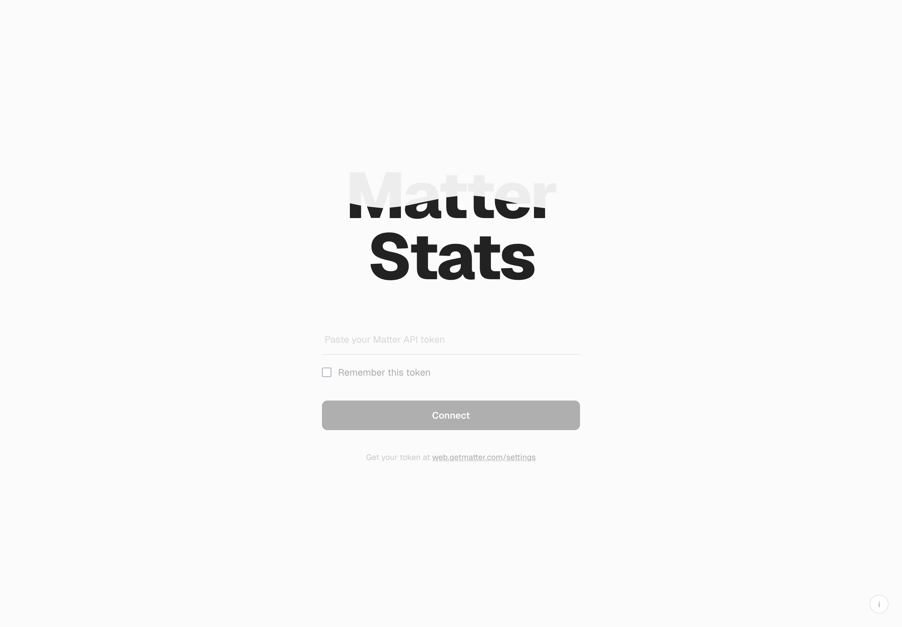
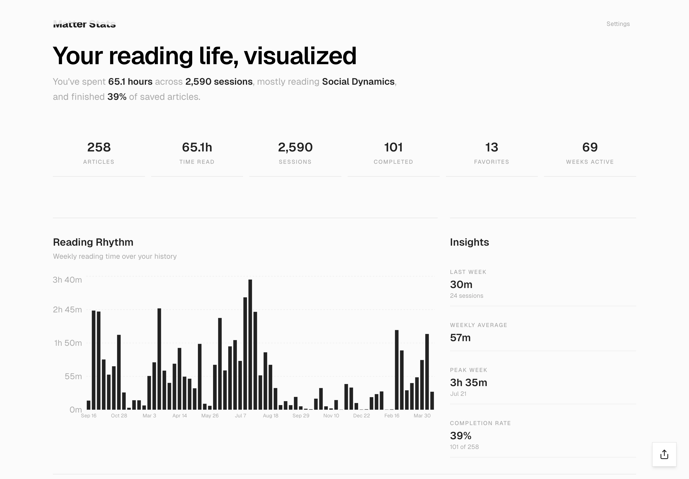
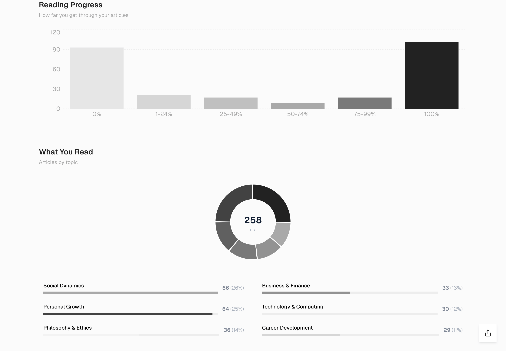
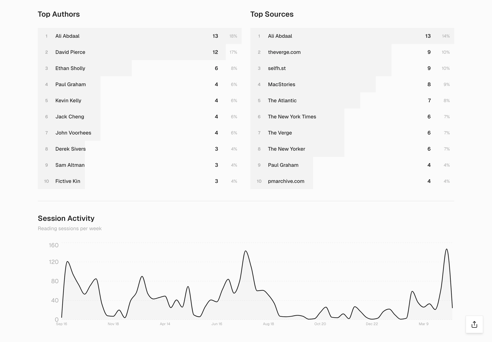

# Matter Stats

A reading analytics dashboard for [Matter](https://getmatter.com). Connects to your Matter account, fetches your reading history, and visualizes it with charts and stats.

**[matterstats.vercel.app](https://matterstats.vercel.app)**

 

<p align="center">
  
</p>
<p align="center">
  
</p>
<p align="center">
  
</p>
<p align="center">
  
</p>

## Features

- **Reading rhythm** — weekly reading time and session counts over your history
- **AI categorization** — articles are automatically grouped into thematic categories using embeddings
- **Author & source leaderboards** — see who and where you read most
- **Progress distribution** — how far you get through saved articles
- **Favorites showcase** — your starred articles in one place
- **Full library browser** — search, filter, and sort your entire reading list

## Getting Started

### Prerequisites

- Node.js 20.9+
- A [Matter](https://getmatter.com) account and API token (find it at [web.getmatter.com/settings](https://web.getmatter.com/settings))
- (Optional) An [OpenRouter](https://openrouter.ai) API key for AI-powered article categorization

### Setup

```bash
git clone https://github.com/fletcheralderton/matterstats.git
cd matterstats
npm install
cp .env.example .env.local
```

Edit `.env.local` and add your OpenRouter API key if you want AI categorization.

### Development

```bash
npm run dev
```

Open [http://localhost:3000](http://localhost:3000) and enter your Matter API token.

### Production Build

```bash
npm run build
npm start
```

## How It Works

1. You enter your Matter API token in the browser (stored in session/local storage)
2. The token is sent to the app's server API routes, which fetch your items and reading sessions from the Matter API
3. If an OpenRouter API key is configured on the server, article titles, excerpts, and author names are sent for AI categorization
4. Data is processed and displayed as interactive charts

## Privacy

- Your Matter token is stored in your browser (session storage by default, local storage if you opt in) and sent only to this app's server and to Matter's API — never to OpenRouter or any other third party
- Article titles, excerpts, and author names are sent to [OpenRouter](https://openrouter.ai) for categorization if configured — no other data is shared
- No analytics, tracking, or telemetry

## Tech Stack

- [Next.js](https://nextjs.org) 16 with App Router
- [React](https://react.dev) 19
- [Recharts](https://recharts.org) for data visualization
- [Tailwind CSS](https://tailwindcss.com) v4
- [OpenRouter](https://openrouter.ai) for AI categorization (optional)

## License

[MIT](LICENSE)
